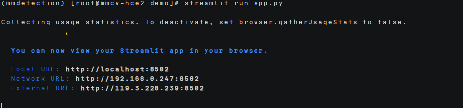
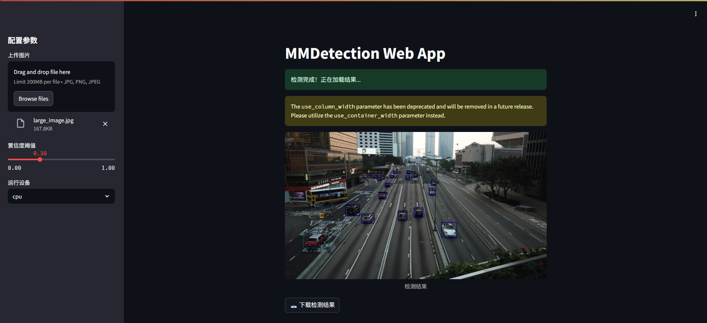

# mmcv部署指南


## ‌一、环境准备


### 更新系统


#### EulerOS2.0


```
yum -y update  
yum -y upgrade
```


#### Ubuntu 24.04


```
apt-get -y update
export DEBIAN_FRONTEND=noninteractive
apt-get -y -o Dpkg::Options::="--force-confold" dist-upgrade
```


## **二、安装conda**


```
mkdir -p ~/miniconda3

wget https://repo.anaconda.com/miniconda/Miniconda3-latest-Linux-aarch64.sh -O ~/miniconda3/miniconda.sh

bash ~/miniconda3/miniconda.sh -b -u -p ~/miniconda3

rm -f ~/miniconda3/miniconda.sh

source ~/miniconda3/bin/activate

conda init --all
```


创建虚拟环境

```
conda create -n mmdetection python=3.9
```


## **三、源码下载**

### **1.安装相应的依赖**

```
\#安装pytorch

conda install pytorch torchvision cpuonly -c pytorch

\#安装mmcv

git clone https://github.com/open-mmlab/mmcv.git

cd mmcv

conda install psutil

conda install pyyaml

pip install pybind11

pip install -e . -v -i https://pypi.tuna.tsinghua.edu.cn/simple #编译构建

python .dev_scripts/check_installation.py #验证安装 没有报错说明安装成功

export MAX_JOBS=1  #降低ninja并行度

pip install mmcv==2.1.0 -f https://download.openmmlab.com/mmcv/dist/cpu/torch2.1.0/index.html -i https://pypi.tuna.tsinghua.edu.cn/simple

\#安装mmdetection
git clone https://github.com/open-mmlab/mmdetection.git

pip install scipy -i https://pypi.tuna.tsinghua.edu.cn/simple

pip install shapely -i https://pypi.tuna.tsinghua.edu.cn/simple

pip install pycocotools -i https://pypi.tuna.tsinghua.edu.cn/simple

pip install -v -e .
#安装streamlit
pip install streamlit -i https://pypi.tuna.tsinghua.edu.cn/simple
```


### **2.下载模型**

```
wget https://download.openmmlab.com/mmdetection/v2.0/centernet/centernet_resnet18_140e_coco/centernet_resnet18_140e_coco_20210705_093630-bb5b3bf7.pth
```

\#这个模型权重在/home/mmdetection/cenrernet/metafile.yaml中。

 

## **四、启动项目**

### **1.修改代码**

官方的推理代码是使用权重文件进行推理，然后将推理结果保存到指定路径下，对代码进行修改，能够实现可视化功能。

创建一个[app.py](../scripts/app.py)

### **2.推理**

修改后的代码运行方式为:

```
streamlit run app.py 
```

运行之后的结果显示为：

 

 然后打开ip+8501网址



调整置信度阈值和运行设备，然后从本地上传图片进行检测，然后就会在右边获得检测后的结果图，这个结果图可以在网页放大，还能够下载到本地查看。
